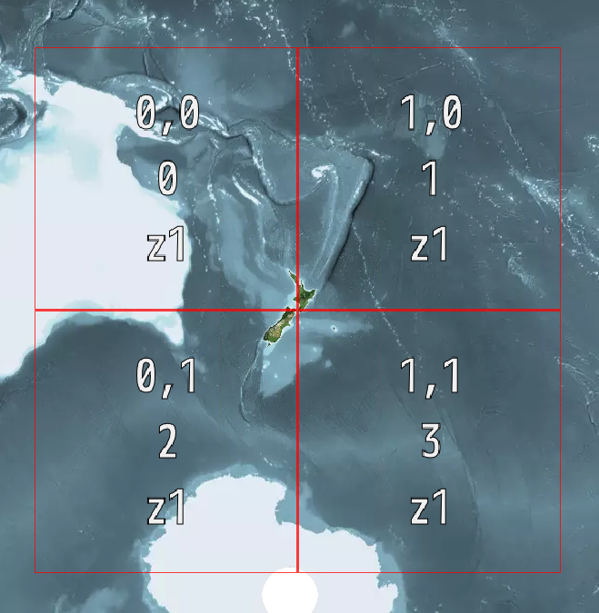

# LINZ Tile Matrix Sets

This repository houses the LINZ's official [Tile Matrix Sets (TMS)](https://www.ogc.org/standards/tms) for NZTM2000 ([EPGS:2193](http://epsg.io/2193))

- [NZTM2000Quad](./raw/NZTM2000Quad.json)
- [NZTM2000](./raw/NZTM2000.json)

## NZTM2000Quad (March 2021 [DRAFT])

The NZTM2000 Quad TMS is new tile matrix set to provide greater interoperability with LINZs 2193 web services and third parties.

It is based heavily off Google's [WebMercatorQuad](https://docs.opengeospatial.org/is/17-083r2/17-083r2.html#62) TMS.



Key Features:

- All zoom scales are from Google's WebMercatorQuad
- Tile matrix extent and tile extent are the same
- All zoom levels are square to work with techniques like quad keys
- All zoom levels increase by a factor of two
- The map is centered on the beehive
 
LINZ decided to create the NZTM2000Quad based off compatibility issues with the original NZTM2000 TMS and third parties.


## NZTM2000 
LINZ's original tile matrix set, designed for use with cartographic tooling that needs specific carto zoom scales

https://www.linz.govt.nz/data/linz-data-service/guides-and-documentation/nztm2000-map-tile-service-schema


## NPM Package

This repository also houses NPM package that distributes the NZTM tile matrix sets for use in web mapping applications such as OpenLayers

### Installation
```
yarn add @linzjs/tile-matrix-set
```

### Usage
```typescript
import {Nztm2000Quad} from '@linzjs/tile-matrix-set'

Nztm2000Quad.identifier // NZTM2000Quad
```